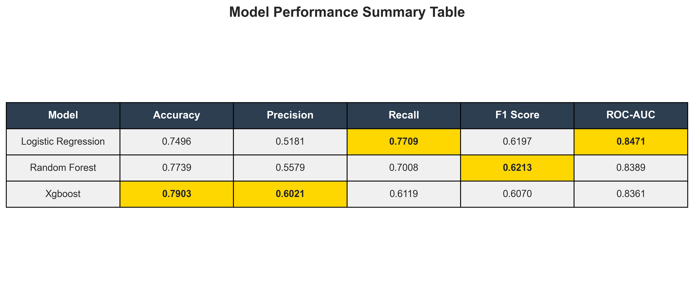

# Customer Churn Prediction System with Explainable AI

A comprehensive machine learning system for predicting customer churn in telecom/SaaS businesses, featuring explainability through SHAP and LIME, and an interactive Streamlit dashboard.

## 🎯 Features

- **Multi-Model Training**: Logistic Regression, Random Forest, and XGBoost
- **Explainable AI**: SHAP and LIME explanations for model predictions
- **Class Imbalance Handling**: SMOTE oversampling
- **Interactive Dashboard**: Streamlit web app for predictions and visualizations
- **Comprehensive EDA**: Jupyter notebooks for exploratory data analysis
- **Production-Ready**: Config-driven, logging, and modular architecture
- **Full Pipeline**: End-to-end ML pipeline from data ingestion to deployment

## 📊 Project Structure

\`\`\`
churn-prediction-xai/
├── config/
│   └── config.yaml              # Configuration file
├── data/
│   ├── raw/                     # Raw dataset
│   ├── processed/               # Processed data
│   ├── models/                  # Trained models
│   ├── results/                 # Evaluation results
│   └── plots/                   # Visualizations
├── docs/images/                 # README visualizations
├── notebooks/
│   └── 01_exploratory_data_analysis.ipynb
├── src/
│   ├── ingestion/               # Data loading
│   ├── preprocessing/           # Data preprocessing
│   ├── models/                  # ML models
│   ├── evaluation/              # Model evaluation
│   ├── explainability/          # SHAP & LIME
│   ├── visualization/           # Plotting utilities
│   └── utils/                   # Config & logging
├── tests/
│   └── test_pipeline.py         # Unit tests
├── main.py                      # Training pipeline
├── app.py                       # Streamlit dashboard
├── requirements.txt
├── ACKNOWLEDGEMENTS.md
└── README.md
\`\`\`

## 🚀 Quick Start

### Installation

\`\`\`bash
# Clone the repository
git clone <repository-url>
cd churn-prediction-xai

# Install dependencies
pip install -r requirements.txt
\`\`\`

### Run the Training Pipeline

\`\`\`bash
# Train all models and generate reports
python main.py

# Skip dataset download if already exists
python main.py --skip-download

# Windows: Use batch file
run_pipeline.bat
\`\`\`

### Launch the Dashboard

\`\`\`bash
streamlit run app.py

# Windows: Use batch file
run_dashboard.bat
\`\`\`

Then open your browser to \`http://localhost:8501\`

## 📈 Model Performance Results

### Performance Summary Table

### Detailed Performance Metrics

| Model | Accuracy | Precision | Recall | F1 Score | ROC-AUC |
|-------|----------|-----------|--------|----------|---------|
| **Random Forest** | **77.39%** | 55.79% | **70.08%** | **62.13%** | 0.8389 |
| **Logistic Regression** | 74.96% | 51.81% | 77.09% | 61.97% | **0.8471** |
| **XGBoost** | **79.03%** | **60.21%** | 61.19% | 60.70% | 0.8361 |

*Results on test set (20% holdout) after SMOTE balancing*

### Performance Heatmap

### ROC-AUC Score Ranking

### Best Model per Metric

**Key Insights:**
- **Best Accuracy**: XGBoost (79.03%)
- **Best Precision**: XGBoost (60.21%)
- **Best Recall**: Logistic Regression (77.09%)
- **Best F1 Score**: Random Forest (62.13%)
- **Best ROC-AUC**: Logistic Regression (0.8471)

### Precision, Recall, and F1 Score Breakdown

### Confusion Matrices

## 🎯 Model Selection Guide

| Use Case | Recommended Model | Why |
|----------|-------------------|-----|
| **Minimize False Negatives** | Logistic Regression | Highest Recall (77.09%) |
| **Balanced Performance** | Random Forest | Best F1 Score (62.13%) |
| **Minimize False Positives** | XGBoost | Highest Precision (60.21%) |
| **Best Overall Discrimination** | Logistic Regression | Highest ROC-AUC (0.8471) |

---

**Built with Python, scikit-learn, XGBoost, SHAP, and Streamlit**

For detailed documentation, see [PROJECT_OVERVIEW.md](PROJECT_OVERVIEW.md)
