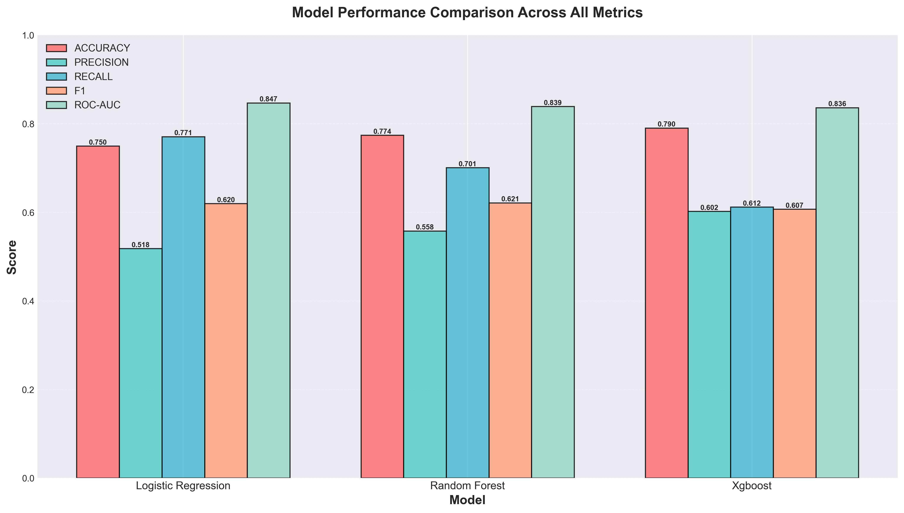
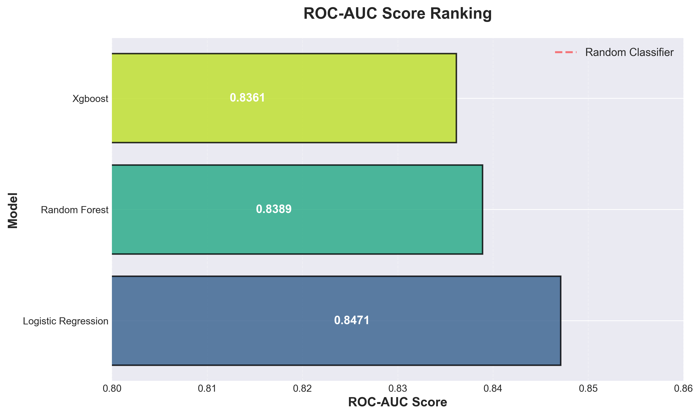
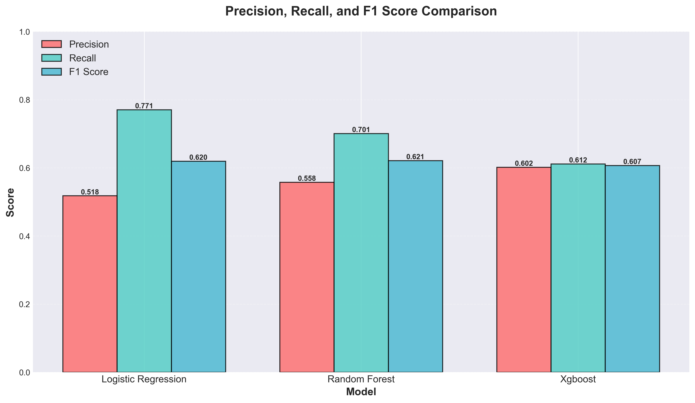

# Customer Churn Prediction System with Explainable AI

A comprehensive machine learning system for predicting customer churn in telecom/SaaS businesses, featuring explainability through SHAP and LIME, and an interactive Streamlit dashboard.



## 🎯 Features

- **Multi-Model Training**: Logistic Regression, Random Forest, and XGBoost
- **Explainable AI**: SHAP and LIME explanations for model predictions
- **Class Imbalance Handling**: SMOTE oversampling
- **Interactive Dashboard**: Streamlit web app for predictions and visualizations
- **Comprehensive EDA**: Jupyter notebooks for exploratory data analysis
- **Production-Ready**: Config-driven, logging, and modular architecture
- **Full Pipeline**: End-to-end ML pipeline from data ingestion to deployment

## 📊 Project Structure

```
xai-churn-predictor/
├── config/
│   └── config.yaml                          # Configuration file
├── data/
│   ├── raw/                                 # Raw dataset
│   ├── processed/                           # Processed data
│   ├── models/                              # Trained models
│   ├── results/                             # Evaluation results
│   └── plots/                               # Visualizations
├── docs/
│   └── images/                              # README visualizations
├── notebooks/
│   └── 01_exploratory_data_analysis.ipynb   # EDA notebook
├── src/
│   ├── ingestion/                           # Data loading
│   │   ├── __init__.py
│   │   └── data_loader.py
│   ├── preprocessing/                       # Data preprocessing
│   │   ├── __init__.py
│   │   └── preprocessor.py
│   ├── models/                              # ML models
│   │   ├── __init__.py
│   │   └── model_trainer.py
│   ├── evaluation/                          # Model evaluation
│   │   ├── __init__.py
│   │   └── evaluator.py
│   ├── explainability/                      # SHAP & LIME
│   │   ├── __init__.py
│   │   └── explainer.py
│   ├── visualization/                       # Plotting utilities
│   │   ├── __init__.py
│   │   └── plotter.py
│   └── utils/                               # Config & logging
│       ├── __init__.py
│       ├── config_loader.py
│       └── logger.py
├── tests/
│   └── test_pipeline.py                     # Unit tests
├── main.py                                  # Training pipeline
├── app.py                                   # Streamlit dashboard
├── requirements.txt                         # Dependencies
├── run_pipeline.bat                         # Windows batch file
├── run_dashboard.bat                        # Windows batch file
├── ACKNOWLEDGEMENTS.md                      # Credits & references
├── CONTRIBUTING.md                          # Contribution guidelines
├── LICENSE                                  # MIT License
├── PROJECT_OVERVIEW.md                      # Detailed project info
├── RESULTS_SUMMARY.md                       # Detailed results
└── README.md                                # This file
```

## 🚀 Quick Start

### Installation

```bash
# Clone the repository
git clone https://github.com/Dex947/xai-churn-predictor.git
cd xai-churn-predictor

# Install dependencies
pip install -r requirements.txt
\`\`\`

### Run the Training Pipeline

\`\`\`bash
# Train all models and generate reports
python main.py

# Skip dataset download if already exists
python main.py --skip-download

# Windows: Use batch file
run_pipeline.bat
\`\`\`

### Launch the Dashboard

\`\`\`bash
streamlit run app.py

# Windows: Use batch file
run_dashboard.bat
\`\`\`

Then open your browser to \`http://localhost:8501\`

## 📈 Model Performance Results

### Performance Summary Table


### Detailed Performance Metrics

| Model | Accuracy | Precision | Recall | F1 Score | ROC-AUC |
|-------|----------|-----------|--------|----------|---------|
| **Random Forest** | **77.39%** | 55.79% | **70.08%** | **62.13%** | 0.8389 |
| **Logistic Regression** | 74.96% | 51.81% | 77.09% | 61.97% | **0.8471** |
| **XGBoost** | **79.03%** | **60.21%** | 61.19% | 60.70% | 0.8361 |

*Results on test set (20% holdout) after SMOTE balancing*

### Performance Heatmap


### ROC-AUC Score Ranking



### Best Model per Metric


**Key Insights:**
- **Best Accuracy**: XGBoost (79.03%)
- **Best Precision**: XGBoost (60.21%)
- **Best Recall**: Logistic Regression (77.09%)
- **Best F1 Score**: Random Forest (62.13%)
- **Best ROC-AUC**: Logistic Regression (0.8471)

### Precision, Recall, and F1 Score Breakdown



### Confusion Matrices


## 🎯 Model Selection Guide

| Use Case | Recommended Model | Why |
|----------|-------------------|-----|
| **Minimize False Negatives** | Logistic Regression | Highest Recall (77.09%) |
| **Balanced Performance** | Random Forest | Best F1 Score (62.13%) |
| **Minimize False Positives** | XGBoost | Highest Precision (60.21%) |
| **Best Overall Discrimination** | Logistic Regression | Highest ROC-AUC (0.8471) |

---

**Built with Python, scikit-learn, XGBoost, SHAP, and Streamlit**

For detailed documentation, see [PROJECT_OVERVIEW.md](PROJECT_OVERVIEW.md)
